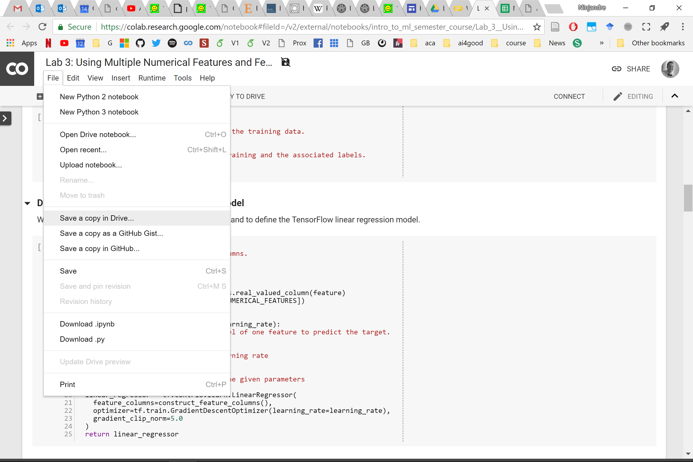

# [Welcome: Labs for Introduction to Machine Learning](https://github.com/ai4socialgood/resources/blob/master/exercises/Welcome_%20Introduction%20to%20Machine%20Learning%20Labs.ipynb)

## Lab Notebooks

- [Lab 1 in Colab](https://drive.google.com/file/d/1FKmLfbKOaoEjpT4fgtZq3MpcGaxlgZxX/view?usp=sharing), [Lab 1 solution in Colab](https://drive.google.com/file/d/1KRbo-4yKbgqLQ6EZl9vCPDYk3aZH_wYI/view?usp=sharing), [Lab 1 in git](Lab_1_Loading_and_Understanding_Your_Data.ipynb), 
- [Lab 2 in Colab](https://drive.google.com/file/d/1E3vqk4651dZWh9VfWxeBRBp7mrrO327L/view?usp=sharing), [Lab 2 solution in Colab](https://drive.google.com/file/d/1e1e_FBwuX30x9kLkdv_nH_dVZGJNql4t/view?usp=sharing), [Lab 2 in git](Lab%202-Training%20Your%20First%20Linear%20Regression%20Model.ipynb), 
- [Lab 3 in Colab](https://drive.google.com/file/d/1UnR8BJRWM957CTgti2u9MlfSe98jlbny/view?usp=sharing) [Lab 3 solution in colab](https://drive.google.com/file/d/1WatEobRa2lO8G80d2Ompm1yNSC2SSuBM/view?usp=sharing)
- [Lab 4 in Colab] (https://drive.google.com/file/d/1fSD2pesQWgG_hQ173GOnyFRqoQByLPbb/view?usp=sharing), [Lab 4 solution in colab](https://drive.google.com/file/d/1af-9FgtT5hinYqRHRQSUyvyeRSGx6q6Y/view?usp=sharing)
- Lab 5

## Colab setup
When you open the notebooks in Colab, they will be read-only. Simply copy them as shown below

